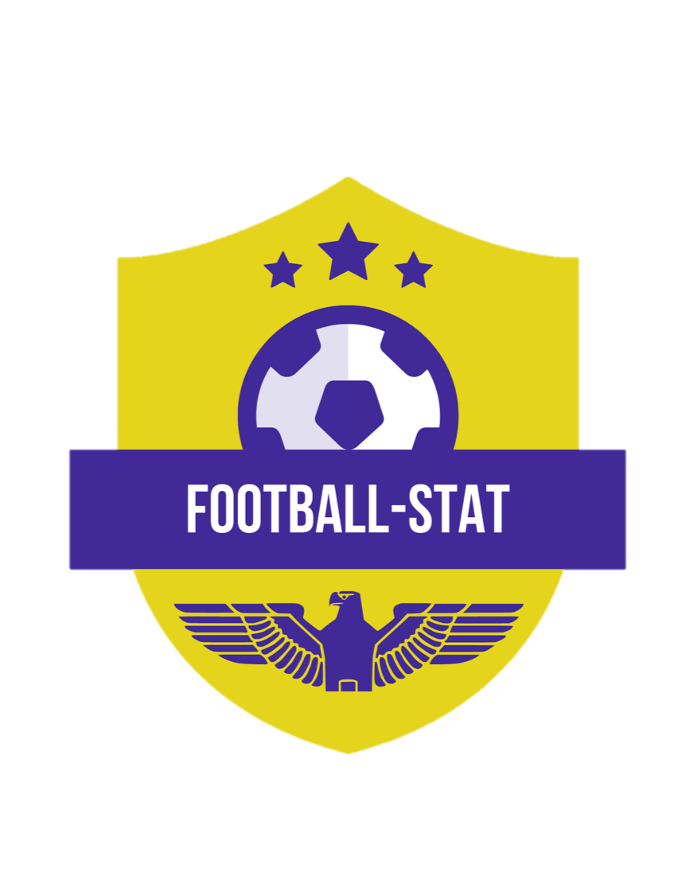
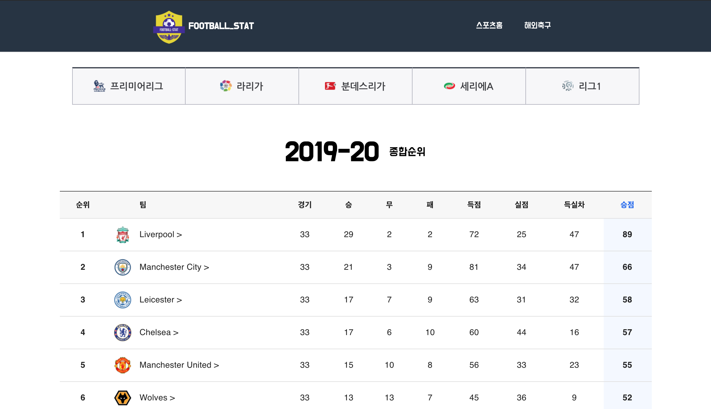
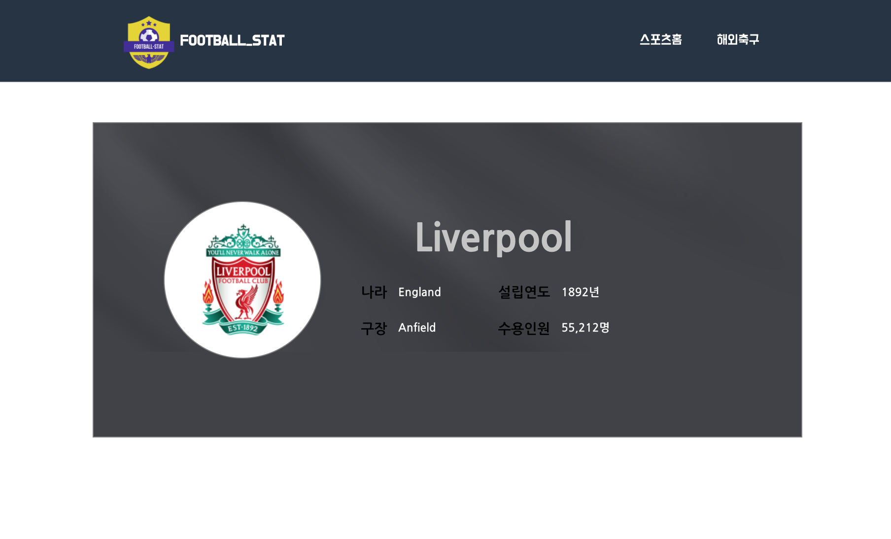

#Football-stat

## Table of Contents
- [Table of Contents](#table-of-contents)
- [About The Project](#about-the-project)
  - [Built With](#built-with)
- [Getting Started](#getting-started)
  - [Prerequisites](#prerequisites)
  - [Installation](#installation)
- [Usage](#usage)
- [Contact](#contact)

 
 

## About The Project

 

제공 데이터
- 유럽 5대리그(프리미어리그, 라리가, 분데스리가, 세리에A, 리그1) 리그별 순위를 제공합니다
- 각 팀별 정보(해당 국가, 설립 연도, 구장 이름, 구장 수용 인원)를 제공합니다
- 축구 관련 데이터를 전문으로 제공하는 API Football의 API 사용하였습니다.

기술 스택
- 데이터 상태 관리를 위해 Redux, React Hooks를 사용하였습니다.
- Redux 는 DUCKS 패턴으로 작성되었습니다.
- Redux, Redux-Thunk를 활용하여 API 호출 기능을 개발하였습니다. 

 
 

### Built With
- [React JS](https://ko.reactjs.org/)
- [React Hooks](https://ko.reactjs.org/docs/hooks-intro.html)
- [Redux](https://redux.js.org/)
- [Redux Thunk](https://github.com/reduxjs/redux-thunk)
- [Material UI](https://material-ui.com/)
- [Styled-components](https://styled-components.com/)
- [API Football](https://www.api-football.com/)

 
 

## Getting Started

### Prerequisites
노드 패키지 매니저 설치
<pre>
<code>
npm install npm@latest -g
</code>
</pre>

### Installation
1. Repo 클론
<pre>
<code>
git clone https://github.com/Kylekoh/football-stat.git
</code>
</pre> 

2. NPM 패키지 설치
<pre>
<code>
npm install
yarn add
</code>
</pre> 

3. 프로젝트 시작
<pre>
<code>
npm start
yarn start
</code>
</pre> 

 
 

## Usage
- 리그 테이블(5대 리그별 팀 순위)

 
- 팀 정보(소속 나라, 설립연도, 구장 이름, 수용 인원)

 
 

## Contact
<ykoh728@gmail.com>